# F1 Championship Live – README 

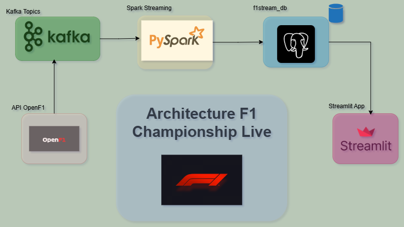

## Aperçu de l’architecture

- **OpenF1 API**  utilisée pour récupérer les résultats officiels de la F1 (courses, pilotes, chronos…) → alimente **Kafka** (topic `race_results_topic`) via un producteur Python.
- **Spark Structured Streaming (PySpark)** lit en continu Kafka, calcule les points F1, et persiste dans **PostgreSQL** (`race_results`, `drivers`, etc.).
- **Streamlit** lit PostgreSQL et affiche :
  - classement course en cours + détails (positions, gaps),
  - classement championnat (points cumulés, podium, taux de victoires),
  - portraits pilotes (via `headshot_url`).

---

## Runbook visuel 

### 1) Lancer l’infrastructure (Docker)
**Figure 3 —** Après `docker-compose up -d`, tous les conteneurs sont **running/healthy** (Zookeeper, Kafka, Postgres, Spark master/worker).  
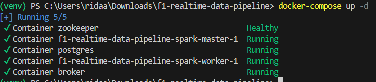

### 2) Réinitialiser PostgreSQL (tables + schémas)
**Figure 4 —** Exécution de `python reset_postgres.py` : suppression des tables & schémas personnalisés → base propre pour une nouvelle ingestion.  
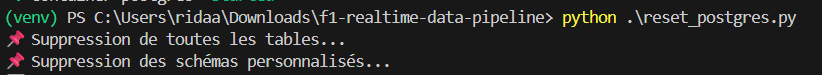

### 3) Démarrer le producteur Kafka
**Figure 5 —** `python kafka_producer.py` : création (si besoin) du topic `race_results_topic`, récupération des résultats OpenF1 2023, **envoi d’un message toutes les 5 s** (un pilote, une ligne).  
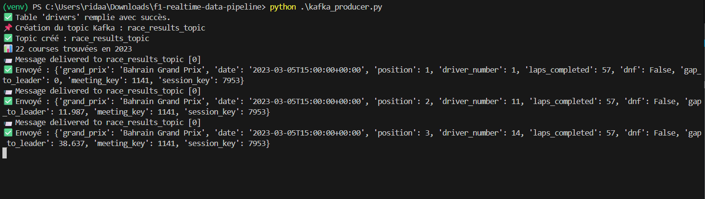

### 4)  Démarrer le consumer Kafka de contrôle
**Figure 6 —** `python kafka_consumer.py` : lecture du topic pour vérifier le flux et la structure des messages (Grand Prix, date, position, driver, laps, DNF, gap, …).  
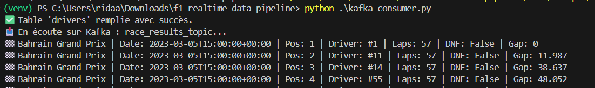

### 5) Lancer l’ingestion & la persistance côté Spark
**Figure 7 —** `python spark_ingestion.py` : job PySpark **Structured Streaming** qui :
- lit `race_results_topic` (offsets historiques inclus),
- calcule les **points officiels F1** (1→25, 2→18, … 10→1),
- cast correctement les dates,
- filtre seulement les résultats **avec position** (course/GP complète),
- **insère en append** dans PostgreSQL (`race_results`), et met à jour `drivers` si besoin.  
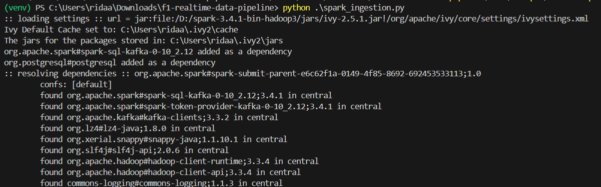

### 7) Monitoring Spark UI
**Figure 9 —** *Spark Jobs* : vue d’ensemble des jobs terminés (durées ~0,6–0,7 s).  
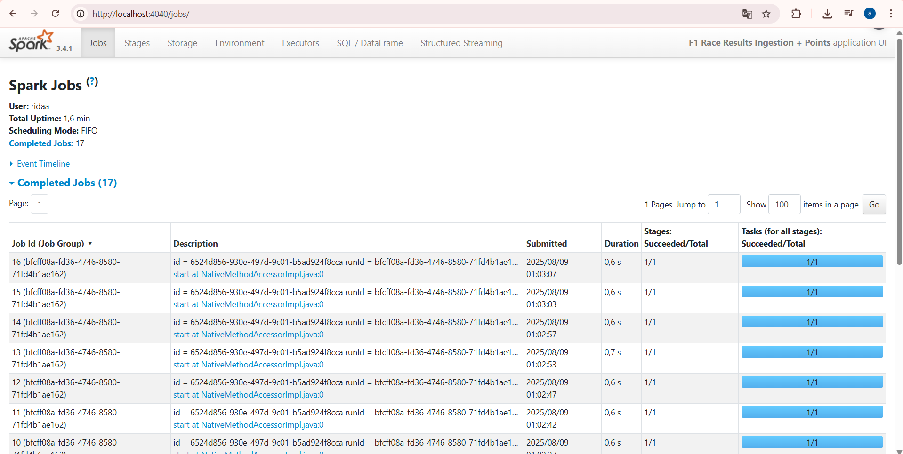

**Figure 10 —** *Stages for All Jobs* : détail par stage (1/1 tasks).  
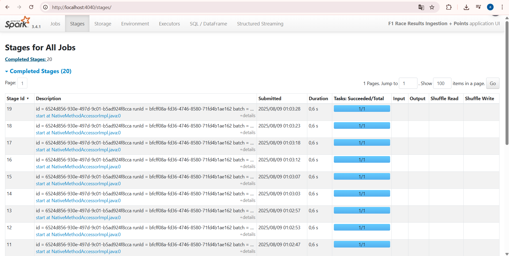

**Figure 11 —** *SQL / DataFrame* : historique des micro-batches (batches 830→838 ici).  
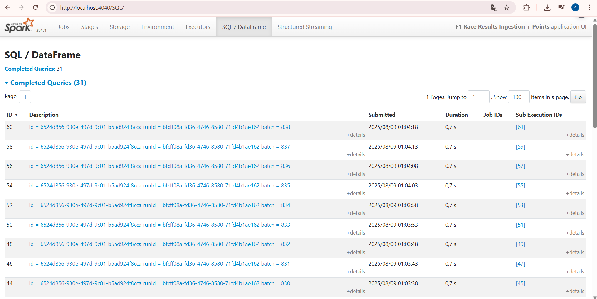

> Accès : Spark UI par défaut sur `http://localhost:4040` (onglets *Jobs*, *Stages*, *SQL / DataFrame*, *Structured Streaming*).

---

## Notes importantes

- Le producteur **n’émet qu’un pilote toutes les 5 s**, pour visualiser l’arrivée progressive des classements.
- Le calcul des points s’effectue **uniquement** quand `position IS NOT NULL` afin d’éviter toute attribution pendant la course.
- Streamlit ne cumule dans le championnat **que les GP terminés** (confirmés par `position` reçue pour chaque pilote du GP).
- Les portraits pilotes proviennent de la table `drivers` (`driver_number`, `driver_name`, `headshot_url`) alimentée une fois au lancement.
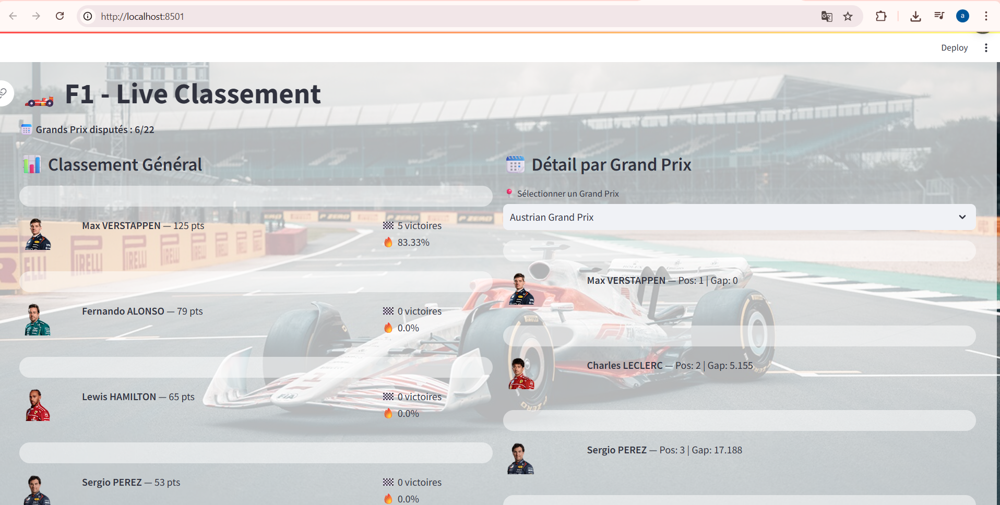

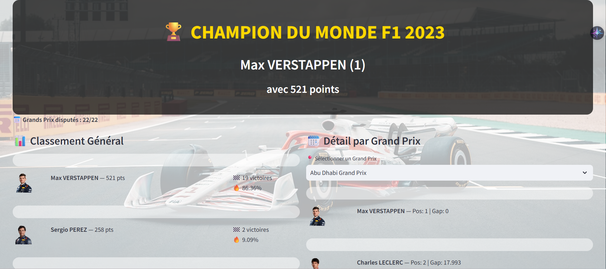

## Prérequis

Avant de lancer le projet, assurez-vous d’avoir :

- **Docker** installé 
- **Python 3.9+** avec `pip` et un environnement virtuel (`venv` ou `conda`)
- Accès à Internet (pour télécharger les images Docker et dépendances Python)
- Ports disponibles :
  - `8501` → Streamlit
  - `9092` → Kafka
  - `5432` → PostgreSQL
  - `4040` → Spark UI

# 1️ Cloner le dépôt et se placer dans le dossier
git clone repo
cd <repo>

# 2️ Lancer l’infrastructure Docker (Kafka, Zookeeper, Postgres, Spark)

docker-compose up -d

# 3️ Créer et activer l’environnement Python
python -m venv venv
source venv/bin/activate   # sous Linux/Mac
venv\Scripts\activate      # sous Windows

# 4️ Installer les dépendances Python
pip install -r requirements.txt

# 5️ Réinitialiser la base PostgreSQL
python reset_postgres.py

# 6️ Démarrer le producteur Kafka (alimente le topic race_results_topic)
python kafka_producer.py

# 7️ (Optionnel) Vérifier le flux Kafka avec un consumer
python kafka_consumer.py

# 8️ Lancer l’ingestion Spark Structured Streaming (lecture Kafka → PostgreSQL)
python spark_ingestion.py

# 9️ Démarrer l’interface Streamlit (visualisation en direct)
streamlit run streamlit-app.py

### ℹ Accès aux interfaces :
### Streamlit   → http://localhost:8501
### Spark UI    → http://localhost:4040
### PostgreSQL  → localhost:5432 (DBeaver, pgAdmin…)

---

